By Selman Karaosmanoglu 

## Date created

8 July 2024

# Rust Axum Deployment on AWS Lambda Serverless

## Overview

This repository provides a guide for deploying a Rust-based AWS Lambda function utilizing the Polars library on AWS Lambda

## Architecture

```mermaid
flowchart LR;
    A((HTTPS invoke)) <-.-> B((AWS Lambda λ));
    B <--> C[main.rs];
    B <--> D[lib.rs];
    B <--> E[Dataset];
```



## Getting Started

## Install Rust

If you don't have Rust on your system install rust using https://rustup.rs

```bash
curl --proto '=https' --tlsv1.2 -sSf https://sh.rustup.rs | sh
```

## Install Cargo lambda

Cargo Lambda simplifies running, building, and deploying Rust functions on AWS Lambda without needing containers or VMs.

```bash
brew tap cargo-lambda/cargo-lambda
brew install cargo-lambda
```

For more information or other installation information on Cargo Lambda: https://www.cargo-lambda.info/guide/getting-started.html

## AWS CLI

### Make sure AWS CLI installed and configured.

If not, you can install with pip

```bash
pip install awscli
```

### Configure AWS

```bash
aws configure
```

## Testing locally

### Run the Rust app locally

```bash
cargo lambda watch
```


Alternatively you can use `make watch`

### Test locally with curl in another terminal

```bash
curl -X POST http://localhost:9000/ -H "Content-Type: application/json" -d '{"height": 1.75, "weight": 70}'
```


## Deploy to AWS

```bash
make build && make deploy
```


## Test deployed app with curl


### Testing rust polars

Instead of https://wsfvqpzkaok3t3xhjjnjbvhi740jtlqt.lambda-url.eu-west-2.on.aws, write your own AWS lambda URL.

```bash
curl https://wsfvqpzkaok3t3xhjjnjbvhi740jtlqt.lambda-url.eu-west-2.on.aws/iris/filter/5
```


### Testing BMI calculation

```bash
curl -X POST https://wsfvqpzkaok3t3xhjjnjbvhi740jtlqt.lambda-url.eu-west-2.on.aws/ -H "Content-Type: application/json" -d '{"height": 1.75, "weight": 70}'
```


### Test with AWS console

 

### Lambda Function Summary


## Reference

* Rust AWS Lambda - O'Reiily 
